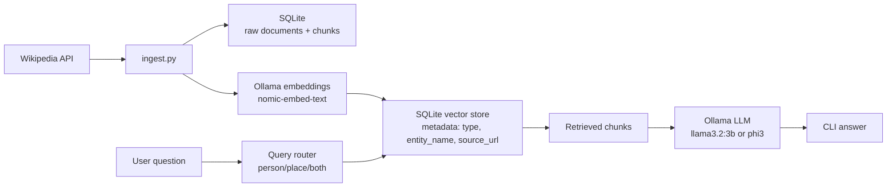

# Local Wikipedia RAG Assistant

This project implements a local Retrieval-Augmented Generation (RAG) assistant that answers questions about famous people and famous places using Wikipedia data stored on the local machine. The application uses:

- Python for orchestration
- SQLite for raw document, chunk, and embedding persistence
- a native SQLite-backed vector search implementation
- Ollama for local embeddings and local answer generation
- a CLI chat interface

The system ingests at least 20 famous people and 20 famous places, chunks the Wikipedia pages, embeds them locally, stores them in a local vector database, and answers questions using only retrieved context.

## Interpretation Notes

This submission makes the following explicit choices to resolve ambiguous parts of the assignment:

- It uses a native SQLite-backed vector store instead of Chroma, because the assignment also emphasizes using language-native functionality where possible.
- SQLite stores raw documents, chunk text, metadata, and embeddings.
- Ingestion is idempotent: re-running it updates entities instead of duplicating them.
- One vector store with metadata is used rather than two separate stores.
- Mixed queries retrieve from both categories when needed.
- Comparison queries retrieve context for both named entities and generate one combined answer.
- If the embedding model changes, the local index should be rebuilt with `python ingest.py --reset`.

## Prerequisites

- Python `3.8+`
- Ollama installed locally
- Internet access during ingestion to download Wikipedia page content

Python `3.10+` is recommended if you are setting the project up on a fresh machine, but the pinned dependency set is chosen to remain friendly to Python `3.8`.

## Features

- Ingests the required Wikipedia entities locally
- Splits large documents into overlapping chunks
- Uses one local vector store with metadata filtering
- Detects whether a query is about a person, a place, or both
- Generates grounded answers with a local Ollama model
- Returns `I don't know.` when the answer is not supported by retrieved data
- Provides a simple CLI chat interface

## Architecture



## Design Choice: One Vector Store with Metadata

This project uses **one SQLite-backed vector store** with metadata fields such as:

- `type`: `person` or `place`
- `entity_name`
- `source_url`
- `chunk_index`

Why this design was chosen:

- simpler than synchronizing two separate stores
- easier to support mixed questions such as comparisons
- still satisfies the assignment because retrieval can be filtered by metadata
- scales more naturally if more categories are added later
- follows the homework preference for implementing core behavior with native functionality

## Project Structure

```text
.
|-- app.py
|-- cli.py
|-- ingest.py
|-- README.md
|-- Product_prd.md
|-- recommendation.md
|-- requirements.txt
`-- src/
    `-- local_wiki_rag/
        |-- chunking.py
        |-- config.py
        |-- entities.py
        |-- generation.py
        |-- ingestion.py
        |-- ollama_client.py
        |-- retrieval.py
        |-- service.py
        |-- storage.py
        `-- wikipedia.py
```

## Installation

### 1. Install and run Ollama

Install Ollama from [https://ollama.com/download](https://ollama.com/download).

Start the Ollama server:

```powershell
ollama serve
```

Pull the required local models:

```powershell
ollama pull llama3.2:3b
ollama pull nomic-embed-text
```

Optional alternative generation model:

```powershell
ollama pull phi3
```

## How to Ingest the Data

Run the ingestion pipeline:

```powershell
python ingest.py --reset
```

What this does:

- downloads Wikipedia text for the predefined people and places
- stores raw documents in SQLite and in the local `data/raw` folder
- chunks large pages into overlapping passages
- computes embeddings locally through Ollama
- stores chunk embeddings in SQLite

## How to Start the Application

### CLI Application

```powershell
python app.py
```

CLI commands:

- `/ingest`
- `/reset`
- `/clear`
- `/context on`
- `/context off`
- `/stats`
- `/help`
- `/quit`

The CLI supports the assignment's chat-interface requirements:

- ask questions in a chat-style loop
- receive answers from the local assistant
- optionally view retrieved context with `/context on`
- clear the current chat session with `/clear`
- reset the indexed data with `/reset`

## Example Queries

### People

- Who was Albert Einstein and what is he known for
- What did Marie Curie discover
- Why is Nikola Tesla famous
- Compare Lionel Messi and Cristiano Ronaldo
- What is Frida Kahlo known for

### Places

- Where is the Eiffel Tower located
- Why is the Great Wall of China important
- What is Machu Picchu
- What was the Colosseum used for
- Where is Mount Everest

### Mixed

- Which famous place is located in Turkey
- Which person is associated with electricity
- Compare Albert Einstein and Nikola Tesla
- Compare the Eiffel Tower and the Statue of Liberty

### Failure Cases

- Who is the president of Mars
- Tell me about a random unknown person John Doe

## Retrieval and Generation Logic

### Chunking

- Strategy: paragraph-aware chunking with overlap
- Default size: `220` words
- Overlap: `45` words

This balances context preservation with retrieval granularity and helps when documents become long.

### Query Routing

The system uses simple rule-based logic:

- explicit entity-name detection if a known person or place name appears
- keyword hints like `who`, `discover`, `artist` for people
- keyword hints like `where`, `located`, `monument` for places
- mixed questions can retrieve from both categories

For queries classified as `both`, the system retrieves from both people and place data and merges the strongest results into a single context for answer generation.

### Comparison Behavior

When a query explicitly names two entities, the system retrieves context for both and generates one combined comparison answer. The output is a paragraph rather than a table.

### Prompt Budget

To keep local inference practical on smaller models:

- retrieval defaults to `top_k = 3`
- only a few chunks are sent to the generator
- each chunk is reduced to a smaller sentence-level snippet before generation

This keeps latency lower and reduces the chance of prompt overflow.

### Re-ingestion and Embedding Consistency

The ingestion process is designed to be idempotent:

- existing documents are updated
- old chunks for a document are replaced
- old embeddings for a document are removed before inserting new ones

If you change the embedding model, rebuild the index completely:

```powershell
python ingest.py --reset
```

### Grounding

The generation prompt explicitly instructs the model to:

- answer only from retrieved context
- avoid external knowledge
- return `I don't know.` when the context is insufficient

## Configuration

You can override default settings with environment variables:

```powershell
$env:OLLAMA_BASE_URL="http://127.0.0.1:11434"
$env:OLLAMA_LLM_MODEL="phi3"
$env:OLLAMA_EMBED_MODEL="nomic-embed-text"
$env:CHUNK_SIZE_WORDS="220"
$env:CHUNK_OVERLAP_WORDS="45"
$env:DEFAULT_TOP_K="3"
```

## Deliverables Included

- `README.md`
- `Product_prd.md`
- `recommendation.md`
- full source code
- ingestion pipeline
- local vector store creation logic
- CLI chat interface

## Demo Video

Add your Loom or unlisted YouTube video link here before submission:

- `Demo link: TODO`

Recommended demo structure:

1. Briefly explain the architecture.
2. Show a short ingestion example or completed ingestion logs.
3. Show question answering on the completed local index.
4. Explain tradeoffs such as routing, chunking, and local model speed.

This is more realistic than trying to ingest all 40 entities live inside a 5-minute video.

## Suggested Evaluation Checklist

- Known person questions return at least one relevant source chunk.
- Known place questions return at least one relevant source chunk.
- Comparison queries use evidence from both entities.
- Unsupported questions return `I don't know.`
- Re-running ingestion does not create duplicate entities.

## Limitations

- retrieval quality depends on the embedding model and chunk size
- query routing is rule-based rather than learned
- Wikipedia page structure is flattened into plain text
- hallucination is reduced but not completely impossible
- first-time ingestion can take time because embeddings are computed locally

## Troubleshooting

### Ollama is not responding

Make sure this works locally:

```powershell
ollama list
```

Then verify the server is running:

```powershell
ollama serve
```

### The CLI opens but answers fail

This usually means:

- the index has not been built yet
- Ollama is not running
- the required local models have not been pulled

Run:

```powershell
python ingest.py --reset
```

## Instructor Run Checklist

If the instructor follows only this README, the project should run with:

1. `ollama serve`
2. `ollama pull llama3.2:3b`
3. `ollama pull nomic-embed-text`
4. `python ingest.py --reset`
5. `python app.py`
