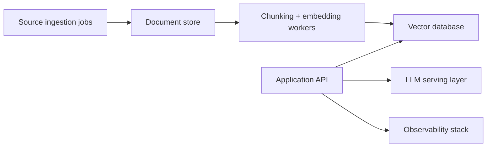

# Recommendation for Production Deployment

## Summary

The current implementation is intentionally optimized for a course assignment and local execution. For a production deployment, the general RAG architecture is valid, but several components should be replaced or strengthened for reliability, scalability, and observability.

## What Should Stay

- retrieval-augmented architecture
- chunked document indexing
- metadata-based filtering
- grounded prompting with explicit fallback behavior

## What Should Change for Production

### 1. Replace ad hoc ingestion with a managed pipeline

Recommended changes:

- schedule ingestion jobs
- validate source freshness
- track document versioning
- log failed ingestions and retries

Rationale:

- production systems need reproducibility and visibility when sources change

### 2. Use a stronger vector backend

Recommended options:

- PostgreSQL with pgvector
- Qdrant
- Weaviate

Rationale:

- a hand-built SQLite vector store is great for coursework and transparency, but larger systems benefit from specialized indexing, filtering, and operational tooling

### 3. Upgrade model serving

Recommended changes:

- keep local inference only if privacy is a hard requirement
- otherwise evaluate dedicated GPU serving
- version models explicitly
- benchmark latency and answer quality per model

Rationale:

- local laptops are fine for demos, but production requires predictable throughput and latency

### 4. Add reranking

Recommended changes:

- keep embedding retrieval for recall
- add reranking to improve precision

Rationale:

- first-pass vector retrieval can miss the best chunk ordering, especially for comparison or multi-hop questions

### 5. Add monitoring and evaluation

Recommended changes:

- log retrieval results and response latency
- build a small benchmark set of expected Q&A pairs
- measure retrieval hit quality and generation correctness

Rationale:

- production quality improves only when failures are visible and measurable

### 6. Add security and guardrails

Recommended changes:

- sanitize user inputs
- cap prompt/context sizes
- isolate model-serving resources
- avoid exposing raw internal file paths in user responses

Rationale:

- local demos can trust the environment, but production should not

## Recommended Production Architecture

## Deployment Recommendation

If this system were moved beyond coursework, I would recommend:

1. Keep the current Python application structure.
2. Move ingestion and indexing into background jobs.
3. Replace the local SQLite vector index with pgvector or Qdrant.
4. Containerize the app, vector store, and model server.
5. Add automated evaluation before each release.

## Final Recommendation

For the assignment, the current localhost implementation is the right choice because it is easy to run, easy to explain, and fully compliant with the no-external-API requirement.

For production, I would keep the RAG design but upgrade:

- storage
- observability
- evaluation
- model serving
- ingestion reliability
